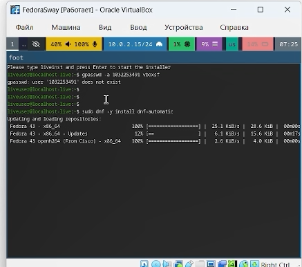
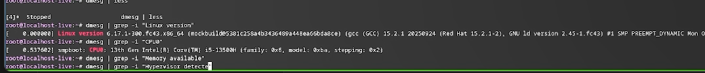

# Информация

## Докладчик

:::::::::::::: {.columns align=center}
::: {.column width="70%"}

  * Нестерова Дарья Антоновна
  * Студент НКАбд-04-25
  * Российский университет дружбы народов
  * [1032253491@rudn.ru](mailto:1032253491@rudn.ru)

:::

::::::::::::::

# Цель работы

Основная цель работы заключается в получении практических навыков по установке операционной системы в среде виртуальной машины, а также по настройке базовых сервисов, необходимых для последующего функционирования системы.

# Задание

- Установка Linux на VirtualBox
- Установка необходимого ПО
- Первоначальная настройка ОС для дальнейшей работы

# Теоретическое введение

Oracle VM VirtualBox — программа для виртуализации, позволяющая запускать несколько ОС на одном компьютере.

Поддерживает гостевые системы: Windows (XP–11), Linux, Solaris, OS/2, macOS (экспериментально). Работает на хостах: Windows, Linux, macOS, FreeBSD, Solaris.

Эмулирует аппаратное обеспечение для архитектур x86, AMD64 и ARM64. Базовая версия распространяется бесплатно с открытым кодом (GPL). 

# Выполнение лабораторной работы

Создаю виртуальный жесткий диск, задаю настройки и запускаю скачанный образ операционной системы.

{#fig:001 width=70%}

---

Скачиваю набор необходимых пакетов для работы с ОС. 

{#fig:003 width=70%}

---

Запускаю скрипт для автоматического обновления пакетов через пакетный менеджер dnf.

{#fig:004 width=70%}

---

Отключаю защиту SELinux, так как на данном курсе мы не будем рассматривать работу с ней.

{#fig:005 width=70%}

---

Настраиваю xkb, добавляю вторую раскладку клавиатуры с русским языком и задаю переключение на right ctrl.

{#fig:006 width=70%}

---

Проверяю корректность заданного имени для hostname. 

{#fig:007 width=70%}

# Домашнее задание

Проверяю последовательность загрузки графического окружения командой dmesg | grep -i с указанием вывода желаемого нахождения.

{#fig:008 width=70%}

# Выводы

В ходе выполнения лабораторной работы мною были освоены приемы работы со средой VirtualBox: создана виртуальная машина, проведена установка необходимого программного обеспечения и выполнены базовые настройки операционной системы.