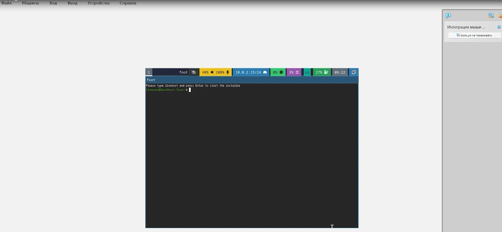
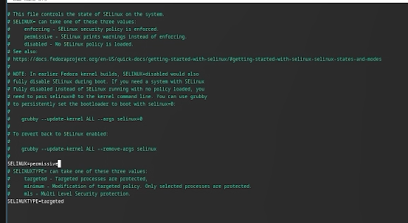
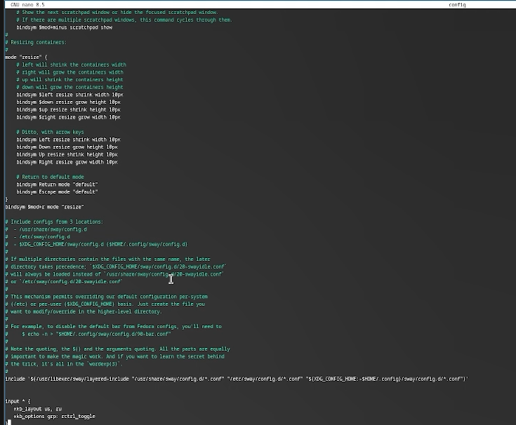
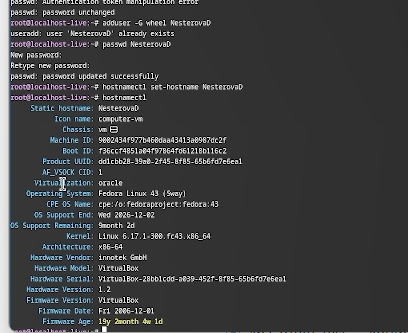

---
## Front matter
title: "Лабораторная работа №1"
author: "Нестерова Дарья Антоновна"

## Generic options
lang: ru-Ru\
toc-title: "Содержание"

## Bibliography
bibliography: bib/cite.bib
csl: pandoc/csl/gost-r-7-0-5-2008-numeric.csl

##Pdf output format
toc: true 
toc-depth: 2
lof: true
lot: true
fontsize: 12pt
linestretch: 1.5
papersize: a4
documentclass: scrreprt

polyglossia-lang:
   name: russian
   options:
   - spelling=modern
   - babelshorhands=true
polyglossia-otherlangs:
   name: english

babel-lang: russian
babel-otherlangs: english
mainfont: Times New Roman
sansfont: Arial
monofont: Courier New
mathfont: Times New Roman

biblatex: true
biblio-style: "gost-numeric"
biblatexoptions:
    - parentracker=true
    - backend=biber
    - hyperref=auto
    - language=auto
    - autolang=other*
    - citestyle=gost-numeric

igureTitle: "Рис."
tableTitle: "Таблица"
listingTitle: "Листинг"
lofTitle: "Список иллюстраций"
lotTitle: "Список таблиц"
lolTitle: "Листинги"

indent: true
header-includes:
  - \usepackage{indentfirst}
  - \usepackage{float} 
  - \floatplacement{figure}{H} 
---

# 1. Цель работы

Основная цель работы заключается в получении практических навыков по установке операционной системы в среде виртуальной машины, а также по настройке базовых сервисов, необходимых для последующего функционирования системы.

# 2. Задание

- Установка Linux на VirtualBox
- Установка необходимого ПО
- Первоначальная настройка ОС для дальнейшей работы

# 3. Теоретическое введение

Oracle VM VirtualBox — программа для виртуализации, позволяющая запускать несколько ОС на одном компьютере.

Поддерживает гостевые системы: Windows (XP–11), Linux, Solaris, OS/2, macOS (экспериментально). Работает на хостах: Windows, Linux, macOS, FreeBSD, Solaris.

Эмулирует аппаратное обеспечение для архитектур x86, AMD64 и ARM64. Базовая версия распространяется бесплатно с открытым кодом (GPL).

# 4. Выполнение лабораторной работы

Создаю виртальный жесткий диск, задаю базовые настройки и запускаю скачанный образ операционной системы. (рис. 1)

{#fig:001 width=70%}

Скачиваю набор необходимых пакетов для работы с ОС. (рис. 2)

{#fig:003 width=70%}

Запускаю скрипт для автоматического обновления пакетов через пакетный менеджер dnf. (рис. 3)

{#fig:004 width=70%}

Отключаю защиту SELinux, так как на данном курсе мы не будем рассматривать работу с ней. (рис. 4)

{#fig:005 width=70%}

Настраиваю xkb, добавляю вторую раскладку клавиатуры с русским языком и задаю переключение на right ctrl. (рис. 5)

{#fig:006 width=70%}

Проверяю корректность заданного имени для hostname. (рис. 6)

{#fig:007 width=70%}

Для выполнения домашнего задания проверяю последовательность загрузки графического окружения командой dmesg | grep -i с указанием вывода желаемого нахождения (рис. 7)

{#fig:008 width=70%}

# 5. Выводы

В ходе выполнения лабораторной работы мною были освоены приемы работы со средой VirtualBox: создана виртуальная машина, проведена установка необходимого программного обеспечения и выполнены базовые настройки операционной системы.

# Список литературы{.unnumbered}

::: {#refs}
:::
