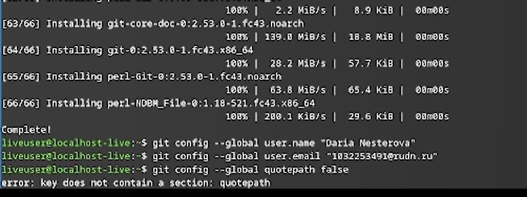
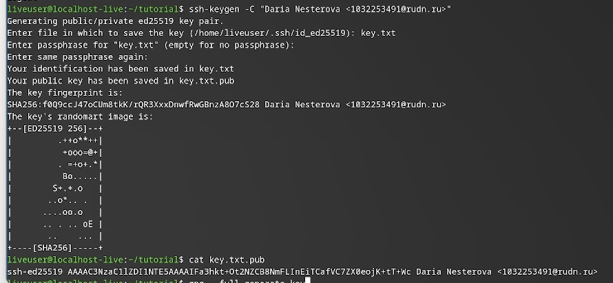
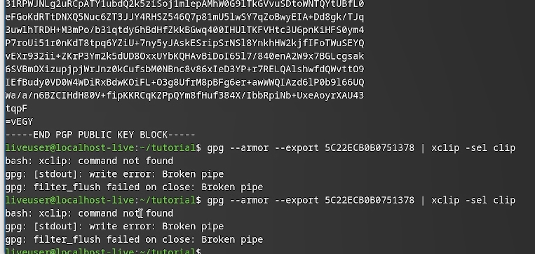
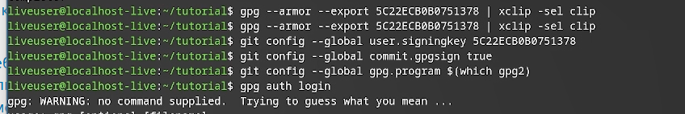
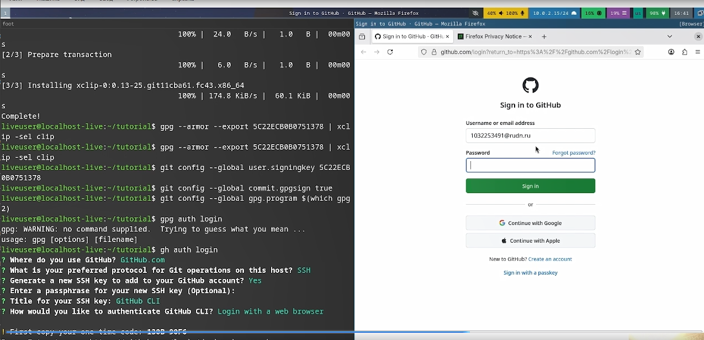
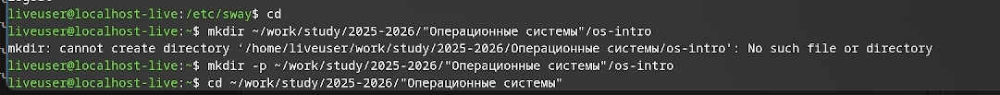
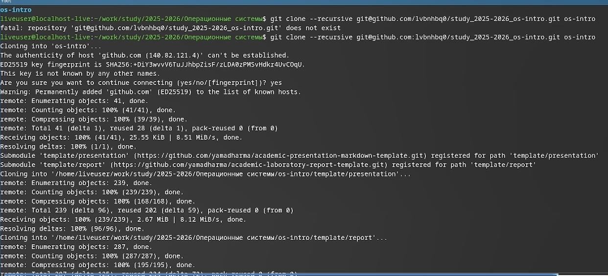

# Информация

## Докладчик

:::::::::::::: {.columns align=center}
::: {.column width="70%"}

  * Нестерова Дарья Антоновна
  * Студент НКАбд-04-25
  * Российский университет дружбы народов
  * [1032253491@rudn.ru](mailto:1032253491@rudn.ru)

:::

::::::::::::::

# Цель работы

Цель работы заключается в теоретическом изучении концепций систем контроля версий и формировании практических навыков эффективного использования инструментария Git.

# Задание

- Создать базовую конфигурацию для работы с git.
- Создать ключ SSH.
- Создать ключ PGP.
- Настроить подписи git.
- Зарегистрироваться на Github.
- Создать локальный каталог для выполнения заданий по предмету.

# Теоретическое введение

Системы контроля версий (VCS) используются для совместной работы над проектами. Проект хранится в репозитории, а VCS позволяет фиксировать изменения, совмещать правки разных участников и возвращаться к более ранним версиям.

В централизованных VCS (например, CVS, Subversion) есть единый сервер-репозиторий. Пользователь получает нужную версию файлов, работает с ней и отправляет изменения обратно. Сервер хранит всю историю правок и для экономии места может применять дельта-компрессию (сохранять только изменения между версиями).
VCS также отслеживают конфликты при одновременной работе с файлом и позволяют их разрешать (слияние, ручной выбор, отмена или блокировка файла). Дополнительные возможности: поддержка ветвления (несколько версий одного файла с общей историей) и детальный журнал изменений с информацией об авторе и времени правок.
В распределённых системах (Git, Mercurial) центральный репозиторий не обязателен.

# Выполнение лабораторной работы

Сначала произвожу базовую настройку git.

{#fig:001 width=70%}

---

Далее создаю ssh и gpg ключи. 

{#fig:002 width=70%}

---

Экспортирую gpg ключ для авторизации на github. 

{#fig:003 width=70%}

---

Настраиваю автоматические подписи для коммитов. 

{#fig:004 width=70%}

---

Авторизуюсь на github для работы через терминал. 

{#fig:005 width=70%}

---

Создаю директорию курса по шаблону

{#fig:006 width=70%}

---

В конце настраиваю рабочую директорию 

{#fig:007 width=70%}

# Выводы

В процессе выполнения лабораторной работы я освоила основные приёмы работы с Git: научилась создавать и настраивать репозитории, генерировать SSH и GPG-ключи, выполнила первичную конфигурацию каталога курса и настроила авторизацию на GitHub.

