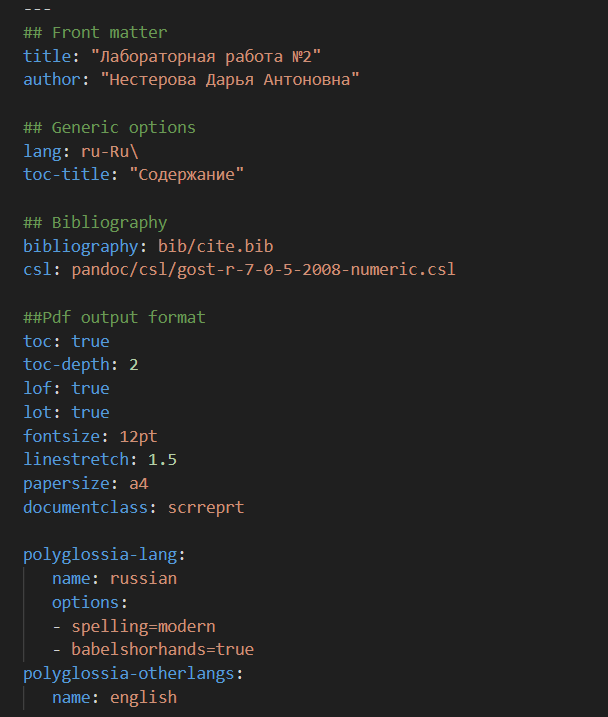
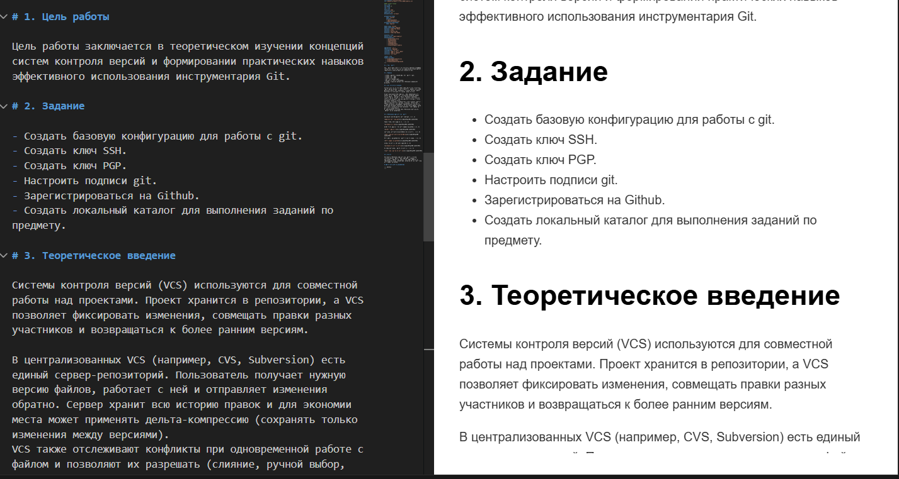
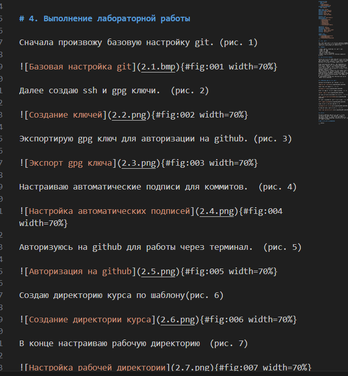
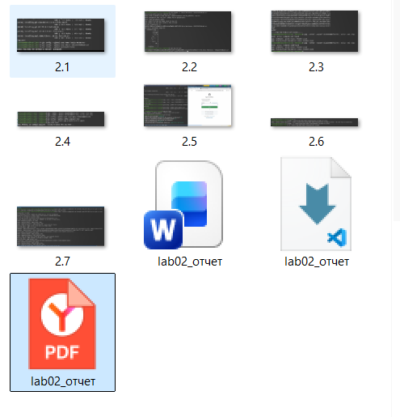

# Информация

## Докладчик

:::::::::::::: {.columns align=center}
::: {.column width="70%"}

  * Нестерова Дарья Антоновна
  * Студент НКАбд-04-25
  * Российский университет дружбы народов
  * [1032253491@rudn.ru](mailto:1032253491@rudn.ru)

:::

::::::::::::::

# Цель работы

Приобретение навыков подготовки отчетов с использованием языка разметки Markdown.

# Задание

- Сделайте отчёт по предыдущей лабораторной работе в формате Markdown.
- В качестве отчёта просьба предоставить отчёты в 3 форматах: pdf, docx и md(в архиве, поскольку он должен содержать скриншоты, Makefile и т.д.)

# Теоретическое введение

Чтобы создать заголовок, используйте знак ( # ). Чтобы задать для текста полужирное начертание, заключите его в двойные звездочки, а для курсивного — в одинарные. Полужирное и курсивное начертание одновременно задается тройными звездочками. Блоки цитирования создаются с помощью символа >. Неупорядоченный (маркированный) список можно отформатировать с помощью звездочек или тире, а упорядоченный — с помощью соответствующих цифр. Чтобы вложить один список в другой, добавьте отступ для элементов дочернего списка. Синтаксис Markdown для встроенной ссылки состоит из части [link text], представляющей текст гиперссылки, и части (file-name.md) — URL-адреса или имени файла, на который дается ссылка. Markdown поддерживает как встраивание фрагментов кода в предложение, так и их размещение между предложениями в виде отдельных огражденных блоков. Внутритекстовые формулы делаются аналогично формулам LaTeX. Для обработки файлов в формате Markdown используется Pandoc.

# Выполнение лабораторной работы

Указываю основную информацию о лабораторной работе, прописываю необходимый код. 

{#fig:001 width=70%}

---

Формирую цель работы, задание и заполняю теоретическое введение. 

{#fig:001 width=70%}

---

Описываю процесс выполнения лабораторной работы. 

{#fig:001 width=70%}

---

Конвертирую файл в нужные форматы и проверяю корректность конвертации.

{#fig:001 width=70%}

# Выводы 

В результате выполнения лабораторной работы были освоены принципы оформления отчетов с импользованием языка разметки Markdown.