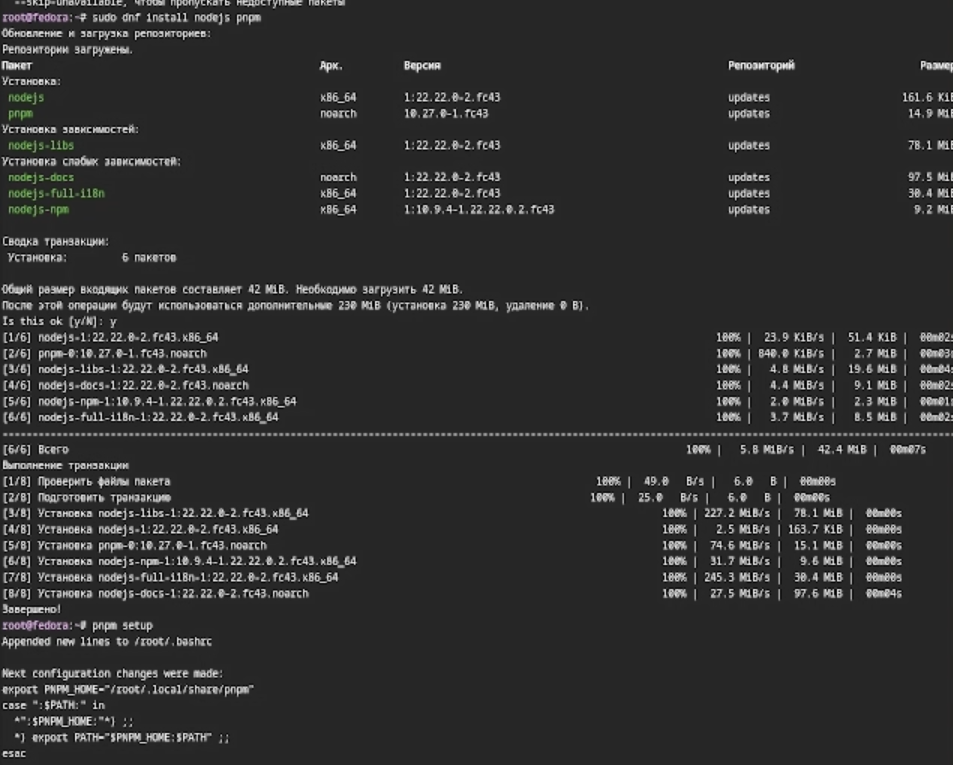
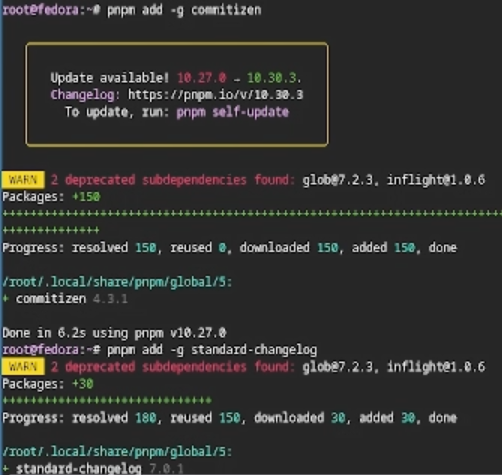
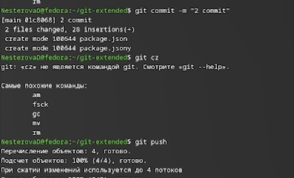
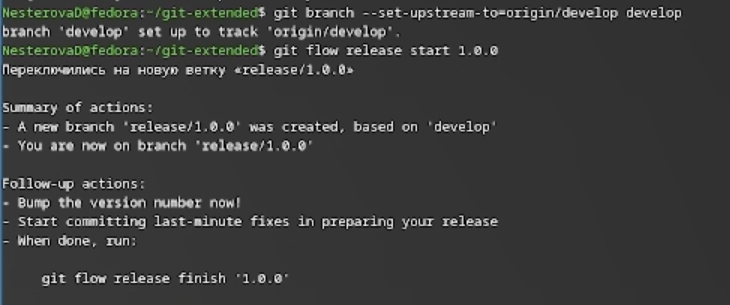
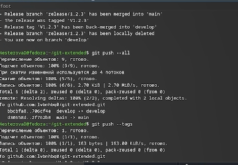

# Информация

## Докладчик

:::::::::::::: {.columns align=center}
::: {.column width="70%"}

  * Нестерова Дарья Антоновна
  * Студент НКАбд-04-25
  * Российский университет дружбы народов
  * [1032253491@rudn.ru](mailto:1032253491@rudn.ru)

:::

::::::::::::::

# Цель работы

Освоение продвинутых методов работы с git-репозиториями и механизмами создания релизов.

# Задание

- Выполнить работу для тестового репозитория.
- Преобразовать рабочий репозиторий в репозиторий с git-flow и conventional commits.

# Теоретическое введение

Gitflow Workflow, опубликованная Винсентом Дриссеном, предполагает строгую модель ветвления с учетом выпуска проекта и включает создание отдельной ветки для исправления ошибок в рабочей среде. Семантическое версионирование (SemVer) задается в формате МАЖОРНАЯ.МИНОРНАЯ.ПАТЧ, где мажорная версия увеличивается при несовместимых изменениях API, минорная — при добавлении новой обратно совместимой функциональности, а патч-версия — при обратно совместимых исправлениях. Conventional Commits — это соглашение о структуре сообщений коммитов, которое тесно связано с SemVer и регламентирует основные типы коммитов.

# Выполнение лабораторной работы

Устанавливаю nodejs, пакетный менеджер для него pnpm и gitflow. 

{#fig:001 width=70%}

---

Устанавливаю через pnpm commitizen и  standard-changelog. 

{#fig:001 width=70%}

---

Создаю новый репозиторий и делаю первый коммит.

{#fig:001 width=70%}

---

Инициализирую и конфигурирую общепринятые коммиты в созданной директиории через редактирование файла package.json. 

{#fig:001 width=70%}

---

Делаю снимок изменений, создаю коммит и отправляю на удаленный репозиторий. 

{#fig:001 width=70%}

---

Инициализурю в репозитории git flow и создаю 1 релиз в только что созданной ветке develop. 

{#fig:001 width=70%}

---

Создаю список изменений через standard-changelog, заканчиваю релиз и выгружаю на удаленный репозиторий изменения. 

{#fig:001 width=70%}

---

Инициализирую ветку feature для работы над новой функциональностью, готовлю релиз и загружаю на github. 

{#fig:001 width=70%}

---

# Выводы

В результате выполнения лабораторной работы были освоены навыки корректной работы с git-репозиториями.

