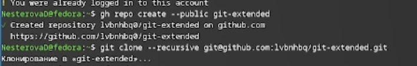
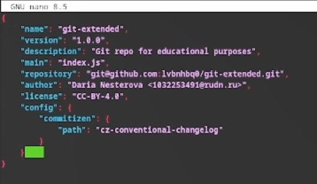
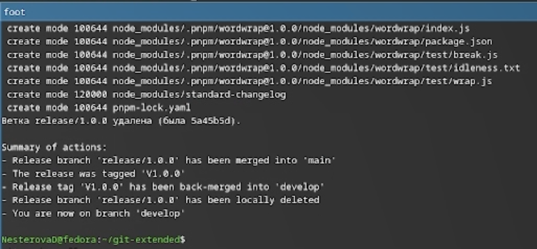

---
## Front matter
title: "Лабораторная работа №4"
author: "Нестерова Дарья Антоновна"

## Generic options
lang: ru-Ru\
toc-title: "Содержание"

## Bibliography
bibliography: bib/cite.bib
csl: pandoc/csl/gost-r-7-0-5-2008-numeric.csl

##Pdf output format
toc: true 
toc-depth: 2
lof: true
lot: true
fontsize: 12pt
linestretch: 1.5
papersize: a4
documentclass: scrreprt

polyglossia-lang:
   name: russian
   options:
   - spelling=modern
   - babelshorhands=true
polyglossia-otherlangs:
   name: english

babel-lang: russian
babel-otherlangs: english
mainfont: Times New Roman
sansfont: Arial
monofont: Courier New
mathfont: Times New Roman

biblatex: true
biblio-style: "gost-numeric"
biblatexoptions:
    - parentracker=true
    - backend=biber
    - hyperref=auto
    - language=auto
    - autolang=other*
    - citestyle=gost-numeric

igureTitle: "Рис."
tableTitle: "Таблица"
listingTitle: "Листинг"
lofTitle: "Список иллюстраций"
lotTitle: "Список таблиц"
lolTitle: "Листинги"

indent: true
header-includes:
  - \usepackage{indentfirst}
  - \usepackage{float} 
  - \floatplacement{figure}{H} 
---

# 1. Цель работы

Освоение продвинутых методов работы с git-репозиториями и механизмами создания релизов.

# 2. Задание

- Выполнить работу для тестового репозитория.
- Преобразовать рабочий репозиторий в репозиторий с git-flow и conventional commits.

# 3. Теоретическое введение

Gitflow Workflow, опубликованная Винсентом Дриссеном, предполагает строгую модель ветвления с учетом выпуска проекта и включает создание отдельной ветки для исправления ошибок в рабочей среде. Семантическое версионирование (SemVer) задается в формате МАЖОРНАЯ.МИНОРНАЯ.ПАТЧ, где мажорная версия увеличивается при несовместимых изменениях API, минорная — при добавлении новой обратно совместимой функциональности, а патч-версия — при обратно совместимых исправлениях. Conventional Commits — это соглашение о структуре сообщений коммитов, которое тесно связано с SemVer и регламентирует основные типы коммитов.

# 4. Выполнение лабораторной работы

Устанавливаю nodejs, пакетный менеджер для него pnpm и gitflow. (рис. 1)

{#fig:001 width=70%}

Устанавливаю через pnpm commitizen и  standard-changelog. (рис. 2) 

{#fig:001 width=70%}

Создаю новый репозиторий и делаю первый коммит. (рис. 3)

{#fig:001 width=70%}

Инициализирую и конфигурирую общепринятые коммиты в созданной директиории через редактирование файла package.json. (рис. 4)

{#fig:001 width=70%}

Делаю снимок изменений, создаю коммит и отправляю на удаленный репозиторий. (рис. 5)

{#fig:001 width=70%}

Инициализурю в репозитории git flow и создаю 1 релиз в только что созданной ветке develop. (рис. 6)

{#fig:001 width=70%}

Создаю список изменений через standard-changelog, заканчиваю релиз и выгружаю на удаленный репозиторий изменения. (рис. 7)

{#fig:001 width=70%}

Инициализирую ветку feature для работы над новой функциональностью, готовлю релиз и загружаю на github. (рис. 8)

{#fig:001 width=70%}

# 5. Выводы

В результате выполнения лабораторной работы были освоены навыки корректной работы с git-репозиториями.

# Список литературы{.unnumbered}

::: {#refs}
:::
