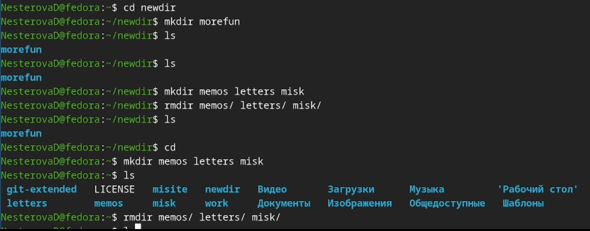

# Информация

## Докладчик

:::::::::::::: {.columns align=center}
::: {.column width="70%"}

  * Нестерова Дарья Антоновна
  * Студент НКАбд-04-25
  * Российский университет дружбы народов
  * [1032253491@rudn.ru](mailto:1032253491@rudn.ru)

:::

::::::::::::::

# Цель работы

Приобретение практических навыков взаимодействия пользователя с системой посредством командной строки.

# Задание

1. Определите полное имя вашего домашнего каталога. Далее относительно этого ката-
лога будут выполняться последующие упражнения.
2. Выполните следующие действия:
2.1. Перейдите в каталог /tmp.
2.2. Выведите на экран содержимое каталога /tmp. Для этого используйте команду ls
с различными опциями. Поясните разницу в выводимой на экран информации.
2.3. Определите, есть ли в каталоге /var/spool подкаталог с именем cron?
2.4. Перейдите в Ваш домашний каталог и выведите на экран его содержимое. Опре-
делите, кто является владельцем файлов и подкаталогов?
3. Выполните следующие действия:
3.1. В домашнем каталоге создайте новый каталог с именем newdir.
3.2. В каталоге ~/newdir создайте новый каталог с именем morefun.
3.3. В домашнем каталоге создайте одной командой три новых каталога с именами
letters, memos, misk. Затем удалите эти каталоги одной командой.
3.4. Попробуйте удалить ранее созданный каталог ~/newdir командой rm. Проверьте,
был ли каталог удалён.
3.5. Удалите каталог ~/newdir/morefun из домашнего каталога. Проверьте, был ли
каталог удалён.

---

4. С помощью команды man определите, какую опцию команды ls нужно использо-
вать для просмотра содержимое не только указанного каталога, но и подкаталогов,
входящих в него.
5. С помощью команды man определите набор опций команды ls, позволяющий отсорти-
ровать по времени последнего изменения выводимый список содержимого каталога
с развёрнутым описанием файлов.
6. Используйте команду man для просмотра описания следующих команд: cd, pwd, mkdir,
rmdir, rm. Поясните основные опции этих команд.
7. Используя информацию, полученную при помощи команды history, выполните мо-
дификацию и исполнение нескольких команд из буфера команд.

---

# Теоретическое введение

В операционной системе типа Linux взаимодействие пользователя с системой обычно осуществляется с помощью командной строки посредством построчного ввода команд. При этом обычно используется командные интерпретаторы языка shell: /bin/sh; /bin/csh; /bin/ksh. Формат команды. Командой в операционной системе называется записанный по специальным правилам текст (возможно с аргументами), представляющий собой указание на выполнение какой-либо функций (или действий) в операционной системе.Обычно первым словом идёт имя команды, остальной текст — аргументы или опции, конкретизирующие действие. 

---

# Выполнение лабораторной работы
Вывожу путь к домашнему каталогу, перехожу в каталог tmp, смотрю его содержимое. 

{#fig:001 width=70%}

---

Использую команду ls с разными флагами. 

{#fig:001 width=70%}

---

Проверяю, есть ли подкаталог cron в каталоге /var/spool. (итог - да, есть)

{#fig:001 width=70%}

---

Проверяю права доступа в домашнем каталоге.

{#fig:001 width=70%}

---

Создаю и удаляю каталоги разными способами, по заданию.

{#fig:001 width=70%}

---

Просматриваю описания различных команд с помощью команды man.

{#fig:001 width=70%}

---

Смотрю историю команд и изменяю некоторые из них. 

{#fig:001 width=70%}

---

# Выводы

Мы приобрели практические навыки взаимодействия пользователя с системой посредством командной строки.