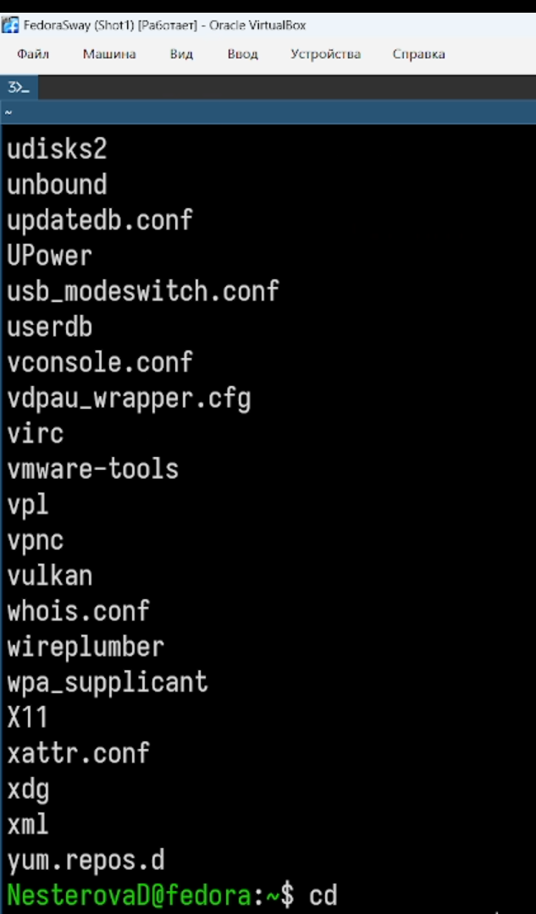
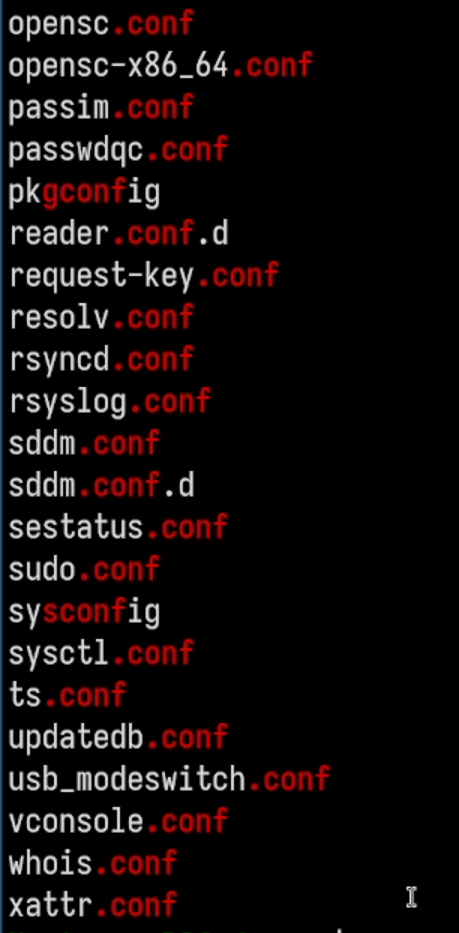
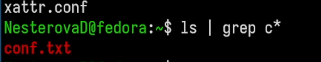
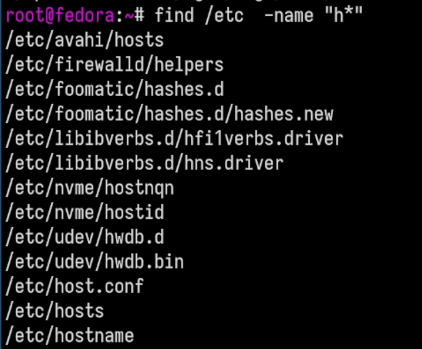
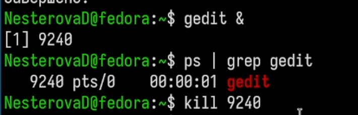

---
## Front matter
title: "Лабораторная работа №8"
author: "Нестерова Дарья Антоновна"

## Generic options
lang: ru-Ru\
toc-title: "Содержание"

## Bibliography
bibliography: bib/cite.bib
csl: pandoc/csl/gost-r-7-0-5-2008-numeric.csl

##Pdf output format
toc: true 
toc-depth: 2
lof: true
lot: true
fontsize: 12pt
linestretch: 1.5
papersize: a4
documentclass: scrreprt

polyglossia-lang:
   name: russian
   options:
   - spelling=modern
   - babelshorhands=true
polyglossia-otherlangs:
   name: english

babel-lang: russian
babel-otherlangs: english
mainfont: Times New Roman
sansfont: Arial
monofont: Courier New
mathfont: Times New Roman

biblatex: true
biblio-style: "gost-numeric"
biblatexoptions:
    - parentracker=true
    - backend=biber
    - hyperref=auto
    - language=auto
    - autolang=other*
    - citestyle=gost-numeric

igureTitle: "Рис."
tableTitle: "Таблица"
listingTitle: "Листинг"
lofTitle: "Список иллюстраций"
lotTitle: "Список таблиц"
lolTitle: "Листинги"

indent: true
header-includes:
  - \usepackage{indentfirst}
  - \usepackage{float} 
  - \floatplacement{figure}{H} 
---

# Цель 

Ознакомление с инструментами поиска файлов и фильтрации текстовых данных.
Приобретение практических навыков: по управлению процессами (и заданиями), по
проверке использования диска и обслуживанию файловых систем.

# Задание

1. Осуществите вход в систему, используя соответствующее имя пользователя.
2. Запишите в файл file.txt названия файлов, содержащихся в каталоге /etc. Допи-
шите в этот же файл названия файлов, содержащихся в вашем домашнем каталоге.
3. Выведите имена всех файлов из file.txt, имеющих расширение .conf, после чего
запишите их в новый текстовой файл conf.txt.
4. Определите, какие файлы в вашем домашнем каталоге имеют имена, начинавшиеся
с символа c? Предложите несколько вариантов, как это сделать.
5. Выведите на экран (по странично) имена файлов из каталога /etc, начинающиеся
с символа h.
6. Запустите в фоновом режиме процесс, который будет записывать в файл ~/logfile
файлы, имена которых начинаются с log.
7. Удалите файл ~/logfile.
8. Запустите из консоли в фоновом режиме редактор gedit.
9. Определите идентификатор процесса gedit, используя команду ps, конвейер и фильтр
grep. Как ещё можно определить идентификатор процесса?
10. Прочтите справку (man) команды kill, после чего используйте её для завершения
процесса gedit.
11. Выполните команды df и du, предварительно получив более подробную информацию
об этих командах, с помощью команды man.
12. Воспользовавшись справкой команды find, выведите имена всех директорий, имею-
щихся в вашем домашнем каталоге.

# Теоретическое введение

В системе по умолчанию открыто три специальных потока:
– stdin — стандартный поток ввода (по умолчанию: клавиатура), файловый дескриптор
0;
– stdout — стандартный поток вывода (по умолчанию: консоль), файловый дескриптор
1;
– stderr — стандартный поток вывод сообщений об ошибках (по умолчанию: консоль),
файловый дескриптор 2.
Большинство используемых в консоли команд и программ записывают результаты
своей работы в стандартный поток вывода stdout. Например, команда ls выводит в стан-
дартный поток вывода (консоль) список файлов в текущей директории. Потоки вывода
и ввода можно перенаправлять на другие файлы или устройства. Проще всего это делается
с помощью символов >, >>, <, <<.
Конвейер (pipe) служит для объединения простых команд или утилит в цепочки, в ко-
торых результат работы предыдущей команды передаётся последующей. 
Команда find используется для поиска и отображения на экран имён файлов, соответ-
ствующих заданной строке символов.

# Выполнение лабораторной работы

Записываю в файл содержимое каталога. (рис. 1)

{#fig:001 width=70%}

Записываю в файл все файлы конфигурации. (рис. 2)

{#fig:002 width=70%}

Вывожу все файлы, начинающиеся на с. (рис. 3)

{#fig:003 width=70%}

Вывожу все файлы, начинаеющиеся на h.(рис. 4)

{#fig:005 width=70%}

Записываю все логи в файл. (рис. 5)

{#fig:006 width=70%}

Открываю в фоне процесс и завершаю его. (рис. 6)

{#fig:007 width=70%}

Вывожу все директории домашнего каталога. (рис. 7)

{#fig:008 width=70%}

# Выводы

Мы ознакомились с инструментами поиска файлов и фильтрации текстовых данных.
Приобрели практических навыков: по управлению процессами (и заданиями), по
проверке использования диска и обслуживанию файловых систем.